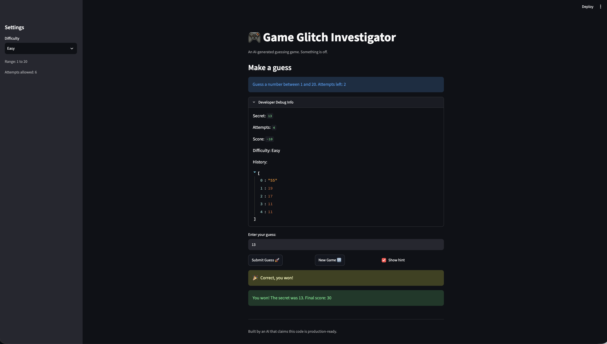

# 🎮 Game Glitch Investigator: The Impossible Guesser

## 🚨 The Situation

You asked an AI to build a simple "Number Guessing Game" using Streamlit.
It wrote the code, ran away, and now the game is unplayable. 

- You can't win.
- The hints lie to you.
- The secret number seems to have commitment issues.

## 🛠️ Setup

1. Install dependencies: `pip install -r requirements.txt`
2. Run the broken app: `python -m streamlit run app.py`

## 🕵️‍♂️ Your Mission

1. **Play the game.** Open the "Developer Debug Info" tab in the app to see the secret number. Try to win.
2. **Find the State Bug.** Why does the secret number change every time you click "Submit"? Ask ChatGPT: *"How do I keep a variable from resetting in Streamlit when I click a button?"*
3. **Fix the Logic.** The hints ("Higher/Lower") are wrong. Fix them.
4. **Refactor & Test.** - Move the logic into `logic_utils.py`.
   - Run `pytest` in your terminal.
   - Keep fixing until all tests pass!

## 📝 Document Your Experience

**The game's purpose:** Streamlit number-guessing game. Pick a difficulty, get a secret number and a limited number of attempts, and guess it using hints before you run out of tries.

**Bugs I found:**
1. The "Too High"/"Too Low" hint messages were swapped relative to their outcome labels — a guess that was too high told you to go higher, and vice versa.
2. On every even-numbered attempt, the secret was cast to a string before being compared, so the comparison fell back to lexicographic (string) ordering instead of numeric, occasionally giving a wrong direction.
3. "New Game" never reset `status`, `score`, or `history`, and redrew the secret from a hardcoded 1-100 instead of the selected difficulty's range — so after a win/loss, clicking it left you stuck on "You already won."
4. There was no validation on guesses outside the difficulty's range (e.g. -500 or 999999 were accepted as valid attempts).
5. The attempt counter incremented even on invalid/non-numeric input.
6. The guess prompt hardcoded "between 1 and 100" regardless of difficulty, and the attempts counter started at 1 instead of 0, undercounting "Attempts left" by one from the start.
7. Switching difficulty mid-game kept the old secret and attempt count under the new difficulty's range and attempt limit.

**Fixes I applied:**
- Rewrote `check_guess` so the hint messages correctly match "Too High" → go lower and "Too Low" → go higher, and made it coerce both `guess` and `secret` to `int` before comparing.
- Reset `status`, `score`, and `history` in the "New Game" handler, and had it draw the new secret from the current difficulty's correct range.
- Added range validation to `parse_guess`, rejecting guesses outside `[low, high]` with a clear error message.
- Moved the attempt-counter increment so it only triggers on a successfully parsed, in-range guess.
- Fixed the guess prompt to return the correct `low`/`high` values, and initialized `attempts` to 0.
- Added a single difficulty-change check that resets the secret, attempts, score, status, and history whenever the difficulty dropdown changes, instead of only initializing state once per session.
- Refactored `get_range_for_difficulty`, `parse_guess`, `check_guess`, and `update_score` out of `app.py` and into `logic_utils.py` as cleaner functions, and added pytests (21 tests) for all of them, including regression tests for the swapped-hint and string-comparison bugs.

## 📸 Demo Walkthrough

Describe your fixed game in numbered steps so a reader can follow along without watching a video:

1. Run `python -m streamlit run app.py` and select "Easy" in the sidebar — the sidebar correctly shows "Range: 1 to 20" and "Attempts allowed: 6", and the guess prompt matches with "Guess a number between 1 and 20."
2. Open the "Developer Debug Info" expander to reveal the secret number (13 in this run).
3. Submit a few guesses (55, 19, 17, 11) and watch the hints correctly point toward 13 each time, and the History log in Developer Debug Info record every guess in order, including the out-of-range "55" that was rejected without consuming an attempt.
4. Guess 13 and see the "🎉 Correct, you won!" popup appear in the same style as the earlier hints, followed by "You won! The secret was 13. Final score: 30."
5. Click "New Game 🔁" to confirm a fresh secret is drawn from the same Easy range (1-20), with attempts, score, and history all reset back to 0/0/empty instead of staying stuck on "You already won."

**Screenshot**: A winning round on Easy difficulty, showing the correct range/attempts in the sidebar, the guess history, and the "Correct, you won!" + final score messages.



## 🧪 Test Results

```
# Paste your pytest output here:

python -m pytest
========================================================== test session starts ==========================================================
platform darwin -- Python 3.14.6, pytest-9.0.3, pluggy-1.6.0
rootdir: /Users/vvirtonen/GitHub/ai110/ai110-module1show-gameglitchinvestigator-starter
plugins: anyio-4.12.1
collected 25 items                                                                                                                      

tests/test_game_logic.py .........................                                                                                [100%]

========================================================== 25 passed in 0.01s ===========================================================

```

## 🚀 Stretch Features

- [x] **Challenge 4 — Enhanced UI: progressive "warmer/colder" hints.** Each hint now also tells you how close you are, based on how far the guess is from the secret relative to the full guessing range:
  - 🔥🔥 "Very close!" — within 5% of the range
  - 🔥 "Warm!" — within 15% of the range
  - 🙂 "Getting warmer" — within 35% of the range
  - ❄️ "Way off" — anything further

  Implemented as a `_warmth_hint` helper in `logic_utils.py` that `check_guess` calls when given the difficulty's `low`/`high`, so a guess like "too high" now shows as `📉 Go LOWER! 🔥 Warm!`. 
  
  It is backwards compatible. Calling `check_guess` without a range skips the warmth text. Covered by 4 new tests and verified by playing in the browser.
